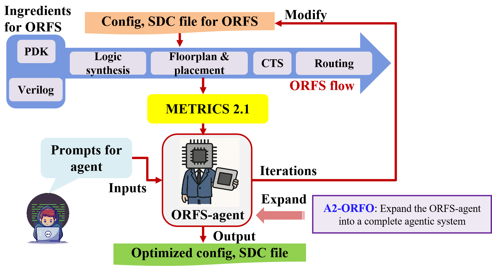
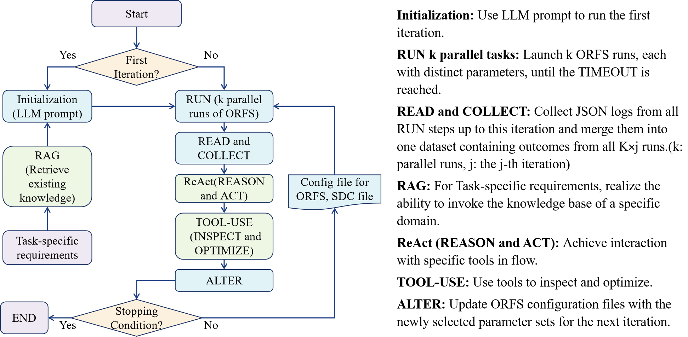

# A2-ORFO: Autonomous Agent for Intelligent OpenROAD Flow Optimization

## Overview
We expand ([ORFS-Agent](https://github.com/ABKGroup/ORFS-Agent#)) into a complete intelligent agent system, namely A2-ORFO (Autonomous Agent for Intelligent OpenROAD Flow Optimization), so that it can retrieve and invoke the information of the knowledge base in a specific domain to tell us how to fix errors. And combine the global search capability of Large Language Models(LLMs) and the efficient sampling Bayesian Optimization (BO) algorithm to conduct hybrid parameter tuning optimization. Combine LLMs agents with BO and use LLMs agents to replace the three basic capabilities of human engineers, including: The ability to retrieve existing knowledge, analyze and think about planning (debugging and comparing historical data), and the ability to use tools (BO, Genetic Algorithm, MCTS), endowing them with stronger perception ability, transfer memory and interpretability.

The agent demonstrates improvements in wirelength and effective clock period by over XX% while using XX% fewer optimization iterations compared to baseline Bayesian optimization approaches and over XX% while using XX% fewer optimization iterations compared to ORFS-Agent. The framework is modular and model-agnostic, working with different LLMs without requiring fine-tuning.



## Framework of A2-ORFO

The framework of A2-ORFO Agent is shown in the left figure below , and the relevant details are introduced on the right below.



## Project Structure

The ORFS-Agent consists of several key components:

### Core Modules

- **`optimize.py`**: Main optimization script using RAG and ReAct techniques to process OpenROAD log files, error messages and optimize the RTL-GDSII flow. Including call the LLM to retrieve existing knowledge to assist optimization and analyze and think about planning to improve the accuracy of the output results under the ReAct framework
- **`inspectfuncs.py`**: Data analysis and inspection tools for understanding parameter space and design metrics
- **`modelfuncs.py`**: Machine learning utilities including Gaussian Process modeling, kernel selection, and preprocessing
- **`agglomfuncs.py`**: Data aggregation and synthesis functions for combining results across multiple runs
- **`constraint_optimizer.py`**: Constraint handling and parameter space definition
- **`AutoTuner-integration`**：The code file integrates the internal Bayesian parameter optimizer Auto-Tuner of ORFS
- **`EDA-Corpus-main/`**：Stores knowledge bases and corpus resources related to design optimization.
- **`rag/`**：Contains the relevant code and configuration files of the RAG framework and is used to implement the 
- **`rag_data/`**：Stores retrieval databases, design logs, error samples, and knowledge index files.
- **`models/`**：Stores trained models, vectorized weights, and embedding files to support model inference and knowledge retrieval.

### Relevant Execution Scripts and Parameter Constraints File

- **`maindriver.sh`**: Primary execution script that orchestrates the entire optimization workflow
- **`run_sequential.sh`**: Handles sequential optimization phases and parameter generation
- **`run_parallel.sh`**: Manages parallel execution of multiple design runs
- **`Makefile`**: Modified OpenROAD Makefile supporting parallel runs with INT_PARAM configuration
- **`opt_config.json`**: Parameter constraints, ranges, and optimization settings for different design-PDK combinations
- **`INSTRUCTIONS.md`**: Setup and execution instructions

### Helper Utilities

- **`helperfuncs/csvmaker.py`**: CSV data generation and formatting utilities
- **`helperfuncs/examine.py`**: Data examination and validation tools
- **`helperfuncs/fixall.sh`**: Batch processing and cleanup utilities

## Key Features

- **RAG**: Retrieve existing knowledge to assist optimization.
- **ReAct Framework**: Analyze and think about planning to improve the accuracy of the output results with local and global optimization
- **Multi-objective Optimization**: Supports optimization of Effective Clock Period (ECP), wirelength (WL), or weighted combinations
- **Parallel Execution**: Efficient parallel processing of multiple design configurations
- **Adaptive Parameter Exploration**: LLM-guided parameter space exploration with constraint handling
- **Multiple PDK Support**: Supports ASAP7 and Sky130HD process design kits
- **Circuit Flexibility**: Works with various circuits including AES, IBEX, and JPEG

## Environment Setup

### Prerequisites

1. **OpenROAD-flow-scripts**: Install and configure OpenROAD-flow-scripts from the specific commit ([ce8d36a](https://github.com/The-OpenROAD-Project/OpenROAD-flow-scripts/tree/ce8d36a)). In order to support the parallel execution of multiple tasks, the Makefile of OpenROAD-flow-scripts needs to be adjusted appropriately: the original single configuration file mechanism is changed to the parametric form, that is, from a single config.mk to config_{INT_PARAM}.mk; Add the INT_PARAM variable in the Makefile to distinguish parallel task instances; Use the provided Makefile as a reference for the required changes.
2. **ORFS-Agent**: Install and configure ORFS-Agent from the address ([ORFS-Agent](https://github.com/ABKGroup/ORFS-Agent#)). In order to unify and optimize logic and interfaces, we need to replace the original identical files in the ORFS-Agent library with the files in the current library. Different files in the ORFS-Agent library will be retained.
3. **Operating System**: Ubuntu/Debian-based system
4. **Hardware Resources**: 
   - Minimum 8 vCPUs per parallel run
   - 8+ GB RAM per parallel run (20-25GB for larger circuits like JPEG)
   - For default configuration: 110 vCPUs and 220GB RAM total

### Environment Setup

#### Python Environment Setup
```bash
# Create virtual environment
python3 -m venv .venv_orfs_agent
source .venv_orfs_agent/bin/activate

# Install required packages
pip install numpy pandas scikit-learn scipy python-dotenv scikit-optimize openai torch
```

#### The Python dependencies required to run the system are described as follows
- `numpy` - Numerical computing
- `pandas` - Data manipulation and analysis
- `scikit-learn` - Machine learning utilities
- `scipy` - Scientific computing
- `openai` - LLM API integration (if using openai models)
- `python-dotenv` - Environment variable management
- `scikit-optimize` - Bayesian optimization
- `torch (pytorch)` -  Numerical computing

#### Additional System Dependencies
```bash
# Install required system tools
sudo apt-get update
sudo apt-get install jq bc timeout
```
#### The system dependencies required to run the system are described as follows:
- `jq` - used for parsing and processing JSON data in the command line
- `bc` - Command-line Calculator, used for precise numerical operations
- `timeout` - Used to limit the execution time of a command or script

## Operating Instructions
### 1. Parameter Configuration

Edit `opt_config.json` to define:

- **Parameter Constraints**: Valid ranges for each tunable parameter
- **Optimization Weights**: Relative importance of different metrics
- **PDK-specific Settings**: Process-dependent parameter bounds

Example configuration structure:
```json
{
  "parameter_constraints": {
    "CORE_UTIL": {"type": "int", "range": [20, 99]},
    "PIN_LAYER_ADJUST": {"type": "float", "range": [0.2, 0.7]}
  },
  "configurations": [
    {
      "platform": "asap7",
      "design": "aes", 
      "goal": "COMBO",
      "weights": {"ecp": 0.5, "dwl": 0.5}
    }
  ]
}
```

### 2. Design-Specific Configuration

Before running an optimization, you may need to adjust the `config.mk` file for your chosen design, as the default files may not define all tunable parameters.

- **Placement Density**: The `PLACE_DENSITY` variable in some `config.mk` files must be replaced with `LB_ADDON_PLACE_DENSITY`. Use the following values:
  - **(aes, asap7)**: 0.3913  
  - **(aes, sky130hd)**: 0.4936  
  - **(ibex, sky130hd)**: 0.2  
  - **(ibex, asap7)**: 0.2  
  - **(jpeg, sky130hd)**: 0.15  
  - **(jpeg, asap7)**: 0.4127

- **TCL Scripts**: Ensure you are using the provided custom TCL scripts (`fastasap.tcl`, `fastsky.tcl`). You must link these in the `config.mk` file for your design. Refer to the example configuration changes in `exampleaes/configchanges.mk` for guidance.

### 3. Resource Planning

Configure resource allocation in `maindriver.sh`:

```bash
TOTAL_ITERS=6        # Number of serial optimization iterations
PARALLEL_RUNS=50     # Parallel runs per iteration
TIMEOUT="45m"        # Timeout per run
TOTAL_CPUS=110       # Total available vCPUs
TOTAL_RAM=220        # Total available RAM (GB)
ECP_WEIGHT=0.5       # Weight for ECP in the final objective
WL_WEIGHT=0.5        # Weight for Wirelength in the final objective
ECP_WEIGHT_SURROGATE=0.5 # Weight for post-CTS ECP in the surrogate model
WL_WEIGHT_SURROGATE=0.5  # Weight for post-CTS WL in the surrogate model
```

### 4. API Key Setup

The agent requires API keys for LLM providers. You will need to add them directly into the source code:

- **OpenAI API Key**: In `optimize.py`, find the placeholder for the OpenAI API key and insert your key. This is required for prompt generation functionalities.

**Note**: For improved security, consider modifying the scripts to load keys from environment variables using the `python-dotenv` package.

### 5. Running the Optimization

Although our internal optimization framework processes are different, the usage is the same as that of ORFS-Agent

#### Basic Usage

```bash
# Make scripts executable
chmod +x maindriver.sh run_parallel.sh run_sequential.sh

# Run optimization
./maindriver.sh -p <platform> -d <design> [options]
```

#### Command Line Options

- **`-p, --platform`**: Target PDK (`asap7` or `sky130hd`)
- **`-d, --design`**: Circuit design (`aes`, `ibex`, or `jpeg`)
- **`-i, --iterations`**: Number of optimization iterations (default: 6)
- **`-r, --parallel-runs`**: Parallel runs per iteration (default: 50)
- **`-t, --timeout`**: Timeout per run (default: 45m)
- **`-o, --objective`**: Optimization goal (`ECP`, `DWL`, or `COMBO`)

#### Example Runs

```bash
# Optimize AES circuit on ASAP7 for ECP
./maindriver.sh -p asap7 -d aes -o ECP

# Optimize IBEX on Sky130HD with custom settings
./maindriver.sh -p sky130hd -d ibex -o COMBO -i 8 -r 30 -t 60m

# Large circuit optimization (JPEG)
./maindriver.sh -p asap7 -d jpeg -o DWL -r 20 -t 90m

# Directly run 6 examples of DWL optimization in full sequence
chmod +x run_all.sh
./run_all.sh
```

#### Output Structure

Each optimization run generates:

- **`../result_dump_<iteration>/`**: Archived results for each iteration
  - `config_*.mk`: Generated configuration files
  - `constraint_*.sdc`: Timing constraint files
  - `logs_dump/`: OpenROAD execution logs
  - `results_dump/`: Synthesis and P&R results

- **`logs/`**: Real-time execution logs organized by platform/design

- **CSV files**: Parameter configurations and results tracking
Note that the results of the original paper were obtained with Claude-3.5 Sonnet and you *must* ensure that your key for replication and/or running of the tool can support frequent tool calls to the model.
